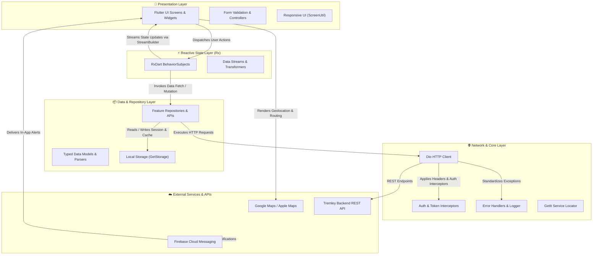

# 💈 Tremley Customer App

A modern, scalable Flutter mobile application for **On-Demand Barber & Salon Booking** built with **Feature-Based Clean Architecture**, **RxDart Reactive State Management**, and **GetIt Dependency Injection**.

---

## 📋 Table of Contents

- [Overview](#-overview)
- [Key Features](#-key-features)
- [Architecture & Design Patterns](#-architecture--design-patterns)
- [Project Directory Structure](#-project-directory-structure)
- [Technology Stack](#️-technology-stack)
- [Getting Started & Configuration](#-getting-started--configuration)
  - [Prerequisites](#prerequisites)
  - [Installation](#installation)
  - [Environment Setup & Secrets](#environment-setup--secrets)
  - [Android Signing Configuration](#android-signing-configuration)
  - [Firebase Setup](#firebase-setup)
  - [Asset Generation](#asset-generation)
  - [Running the App](#running-the-app)
- [API & Network Architecture](#-api--network-architecture)
- [Code Quality & Testing](#-code-quality--testing)
- [License](#-license)

---

## 🎯 Overview

**Tremley** is a complete booking and salon discovery customer mobile platform. It allows users to search nearby barbers and salons, book appointments in-salon or at-home, select time slots, earn and redeem loyalty points, manage active reservations, and receive push notifications for real-time status updates.

---

## ✨ Key Features

- **🔐 Authentication & Security**:
  - Email/Password login and registration with validation
  - Secure OTP verification & password reset flows
  - Token-based authenticated session storage via GetStorage
  - Account deletion with strict privacy compliance

- **📍 Salon & Barber Discovery**:
  - Interactive map view (Google Maps for Android / Apple Maps for iOS)
  - At-home barber booking with address autocomplete and GPS geolocation
  - Filter by ratings, distance, recent salons, and service categories

- **📅 Reservation & Slot Management**:
  - Dynamic slot availability calculation
  - "As Soon As Possible" (ASAP) rapid dispatch booking
  - Reservation history, detailed receipts, rescheduling, and cancellation
  - Post-service ratings and reviews

- **🎁 Loyalty & Fidelity Rewards**:
  - Points earning history per salon
  - Loyalty point redemption for discounted or free services

- **🔔 Notifications & Alerts**:
  - Firebase Cloud Messaging (FCM) push notifications
  - In-app notification center with read/unread tracking

- **👤 User Profile & Customization**:
  - Profile image and personal info management
  - Saved addresses and default location setting
  - Multi-language support (French, English, Portuguese)
  - Help & Support center with interactive FAQs

---

## 🏗️ Architecture & Design Patterns

The codebase follows **Feature-Based Clean Architecture** combined with **MVVM-inspired reactive streams**.



### Core Architecture Highlights:
- **Feature Encapsulation**: Each feature (e.g. `auth`, `home`, `reservations`, `fidelity`) encapsulates its own presentation, data sources, and reactive state management.
- **RxDart Stream Controllers**: State is broadcast using `BehaviorSubject<T>` in dedicated Rx controllers, allowing UI widgets to subscribe via `StreamBuilder` with zero unnecessary rebuilds.
- **Dependency Injection**: Services, HTTP clients, and repositories are decoupled and resolved via `GetIt`.
- **Responsive Layouts**: Scaled design across all screen sizes using `flutter_screenutil`.

---

## 📁 Project Directory Structure

```text
flutter-tremley/
├── lib/
│   ├── common_widgets/              # Global reusable UI components
│   ├── constants/                   # App constants, routes, typography, themes
│   ├── features/                    # Domain features
│   │   ├── auth/                    # Login, signup, OTP, password recovery
│   │   ├── fidelity/                # Loyalty points and rewards
│   │   ├── home/                    # Salon discovery, map, at-home booking
│   │   ├── notifications/           # Push notification list & handlers
│   │   ├── onboarding/              # Intro walkthrough screens
│   │   ├── profile/                 # Profile, addresses, help & FAQ
│   │   ├── reservations/            # Bookings, slots, rescheduling, reviews
│   │   └── splash/                  # App init and route dispatching
│   ├── gen/                         # Auto-generated assets and colors (flutter_gen)
│   ├── helpers/                     # Navigation, DI locator, UI helpers, location
│   ├── networks/                    # Dio client, interceptors, endpoints, error mapping
│   ├── firebase_options.dart        # Firebase platform options configuration
│   ├── loading_screen.dart          # Initial bootstrap screen
│   ├── navigation_screen.dart       # Bottom navigation bar controller
│   └── main.dart                    # Application entry point
├── assets/                          # Icons, images, fonts, and lottie animations
├── android/                         # Android native project & Gradle config
├── ios/                             # iOS native project & CocoaPods config
├── pubspec.yaml                     # Dependencies and asset declarations
└── README.md                        # Documentation
```

---

## 🛠️ Technology Stack

| Technology | Purpose |
|---|---|
| **Flutter 3.x / Dart 3.x** | Core framework and programming language |
| **RxDart** (`^0.28.0`) | Reactive streams and state management |
| **Dio** (`^5.8.0`) | Network client with token interceptors |
| **GetIt** (`^8.0.3`) | Service locator and dependency injection |
| **GetStorage** (`^2.1.1`) | Fast, lightweight key-value local storage |
| **Google Maps / Apple Maps** | Geospatial mapping and routing |
| **Geolocator & Geocoding** | Native GPS location and reverse geocoding |
| **Firebase (Core & Messaging)** | Cloud messaging and push notifications |
| **FlutterScreenUtil** (`^5.9.3`) | Responsive UI scaling |
| **FlutterGen** | Compile-time safe asset and color generation |

---

## 🚀 Getting Started & Configuration

### Prerequisites
- Flutter SDK (3.24.0 or higher)
- Dart SDK (3.5.0 or higher)
- Android Studio / VS Code with Flutter extension
- Xcode (for iOS builds on macOS)

### Installation

1. **Clone the repository:**
   ```bash
   git clone https://github.com/ShahedNoor/flutter-tremley.git
   cd flutter-tremley
   ```

2. **Install Flutter dependencies:**
   ```bash
   flutter pub get
   ```

### Environment Setup & Secrets

Copy the environment example template:
```bash
cp .env.example .env
```

Define any compile-time dart-defines when running:
```bash
flutter run --dart-define=GOOGLE_MAPS_API_KEY=your_actual_key --dart-define=APP_KEY_VALUE=your_app_key
```

### Android Signing Configuration

To configure Android release signing:
1. Copy the example properties file:
   ```bash
   cp android/key.properties.example android/key.properties
   ```
2. Fill in your release keystore path and passwords in `android/key.properties`.
3. If no `key.properties` is present, `build.gradle.kts` automatically falls back to debug signing for safe local builds.

### Firebase Setup

1. **Android**: Copy `android/app/google-services.json.example` to `android/app/google-services.json` and insert your Firebase project credentials.
2. **iOS**: Copy `ios/Runner/GoogleService-Info.plist.example` to `ios/Runner/GoogleService-Info.plist` and insert your Firebase project credentials.
3. Configure `lib/firebase_options.dart` with your project's `apiKey`, `appId`, `messagingSenderId`, and `projectId`.

### Asset Generation

To regenerate strongly typed asset references and colors:
```bash
flutter pub run build_runner build --delete-conflicting-outputs
```

### Running the App

```bash
# Run in debug mode on connected device
flutter run

# Build Android release APK
flutter build apk --release

# Build iOS release bundle
flutter build ios --release
```

---

## 🌐 API & Network Architecture

All network communications pass through the centralized `NetworkConstants` and `Endpoints` classes (`lib/networks/endpoints.dart`).

- **Base URL**: Configurable API gateway (`https://backend.tremley.com/api` by default).
- **Authentication**: JWT Bearer tokens injected into request headers via Dio interceptors.
- **Error Handling**: `ErrorMessageHandler` standardizes server exceptions, validation errors, and network timeouts into localized user feedback.

---

## 🧪 Code Quality & Testing

```bash
# Run static analysis
flutter analyze

# Run unit and widget tests
flutter test

# Format code
dart format lib/
```

---

## 📄 License

This project is licensed under the MIT License - see the [LICENSE](LICENSE) file for details.
